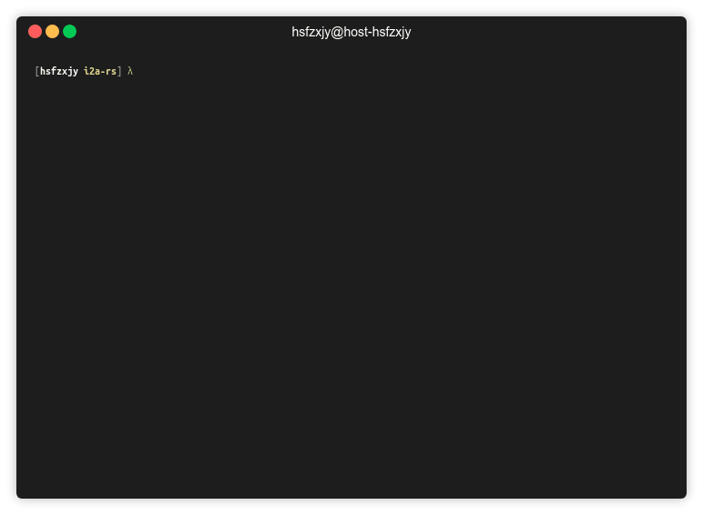
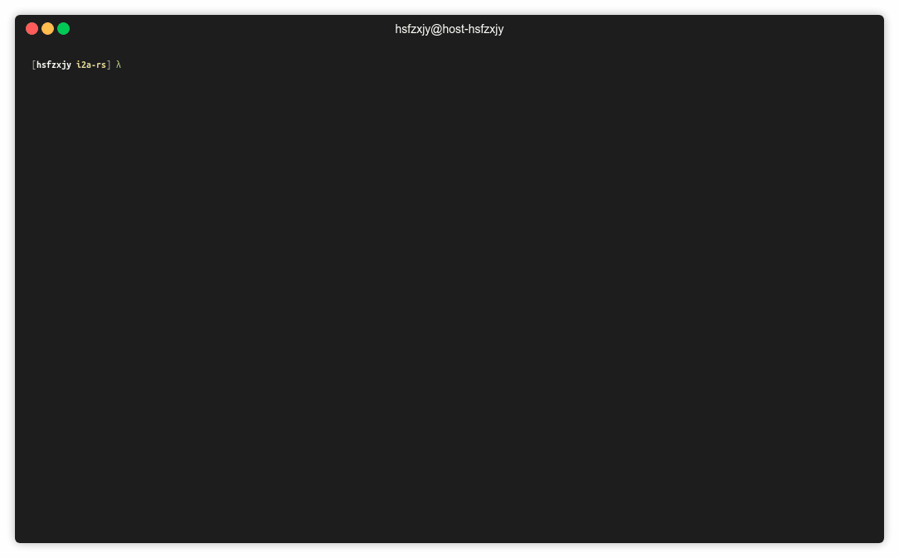

# i2a-rs
Yet another Image to ASCII Art tool

## Highlights

 + **support for multiple formats** `i2a-rs` can render static as well as animated images
 + **responsive** `i2a-rs` automatically resizes images when terminal size changed
 + **efficient** `i2a-rs` calls FFmpeg to decode GIFs and caches rendered stuff for next time use 

## Install

Currently you can install by cloning the repo and build the binary:

```bash
git clone https://github.com/hsfzxjy/i2a-rs/
cd i2a-rs
cargo build --release  
# The release version has better performance while rendering GIFs
```

### FFmpeg

`i2a-rs` requires FFmpeg to decode GIFs, so make sure the command `ffmpeg` is available before rendering a GIF image. You may follow [this link](https://ffmpeg.org/download.html) to get it installed correctly.

## Usage

Render a static image (JPEG, PNG, etc.)

```bash
cargo run --release images/google.png
```




Render a GIF image and play infinitely

```bash
cargo run --release images/cube.gif
```

or just play for one cycle

```bash
cargo run --release images/cube.gif --once
```


